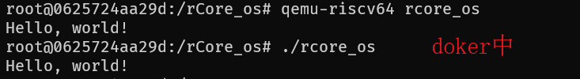
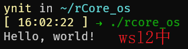

做清华大学操作系统rCore的实验。

实验教程地址：https://rcore-os.github.io/rCore-Tutorial-Book-v3/index.html

原实验构建环境为ubuntu，提供了模拟器和真机等多种运行环境的模式。

笔者这里构建环境使用win10，运行环境为qemu，并且为了方便，构建工具从makefile改变为[cargo-make](https://github.com/sagiegurari/cargo-make)，配置文件为Makefile.toml。

**提醒：最好按照原教程中要求的环境和数据进行测试，以免由于多种原因出错后难以寻找。**

## 问题记录与反馈

#### 第一章第四节 [构建用户态执行环境](https://rcore-os.github.io/rCore-Tutorial-Book-v3/chapter1/3-1-mini-rt-usrland.html)

在本章中，构建的是用户态的执行程序，所以模拟器也需要可直接执行用户态的`qemu-riscv64`，在查询了qemu官方的资料后得知，win上是不行的。故通过wsl2上的`qemu-riscv64`来运行这节的构建产物。

在尝试实验时我遇到了如下两个问题：

- [实现输出字符串的相关函数](https://rcore-os.github.io/rCore-Tutorial-Book-v3/chapter1/3-1-mini-rt-usrland.html#id5) 时，在实现`Write trait`中调用`sys_write`方法时，使用了常量`STDOUT`，该常量没有在本章中给出。从[后面章节](https://rcore-os.github.io/rCore-Tutorial-Book-v3/chapter2/2application.html#id6) 得知控制台的是`1`，即需要在此定义`const STDOUT: usize = 1;`。

- 在完成上面的函数后，教程中提到，这时会编译失败。

  > 系统崩溃了！借助以往的操作系统内核编程经验和与下一节调试kernel的成果经验，我们直接定位为是 **栈 stack** 没有设置的问题。我们需要添加建立栈的代码逻辑。

  但实际测试时，是直接通过的，反而进行了下面的栈设置之后才会出错。猜测本章节是用户态的程序，而设置栈相关的事物应该是在裸机环境，可能是编写时，不小心将后面教程的部分放到了这里。

在这一章的测试时，还发现了一个有意思的事情，编译出来的产物，可以直接在wsl2上的Ubuntu运行(20.04)。刚开始还以为是编译时带了什么东西，后来将产物拷贝到几台不同的服务器上测试都不行。编译产物放在了`extra/tmp_file`下。




#### 第一章第五节 [构建裸机运行时执行环境](https://rcore-os.github.io/rCore-Tutorial-Book-v3/chapter1/3-2-mini-rt-baremetal.html)

在尝试实验时我遇到了如下两个问题：

- [实现关机功能](https://rcore-os.github.io/rCore-Tutorial-Book-v3/chapter1/3-2-mini-rt-baremetal.html#id6) 时，使用了一个常量`SBI_SHUTDOWN`，该常量没有在本章中给出。通过查询[riscv-sbi-doc](https://github.com/riscv/riscv-sbi-doc/blob/master/riscv-sbi.adoc) 得到该值为`8`。但是在设置好之后，其他都是能执行的（打印出了hello world），但还是不能正常退出`qemu`虚拟机，打印出了如下错误，并且`qemu`程序不会结束：

  ```shell
  panicked at 'Unhandled exception! mcause: Exception(StoreFault), mepc: 000000008000261c, mtval: 0000000000100000', platform/qemu/src/main.rs:395:18
  ```
  
上面使用的`win64`的`qemu`，版本为：`QEMU emulator version 5.2.0 (v5.2.0-11850-g0f27b14b91-dirty)`。后在wsl2中使用提供的docker镜像环境测试，运行正常。
  
- [清空 .bss 段](https://rcore-os.github.io/rCore-Tutorial-Book-v3/chapter1/3-2-mini-rt-baremetal.html#bss) 这个功能，教程里描述的是：

  > 我们需要提供清零的 `clear_bss()` 函数。此函数属于执行环境，并在执行环境调用 应用程序的 `rust_main` 主函数前，把 `.bss` 段的全局数据清零。

我理解的是只需要把函数声明在这里，会自动在`rust_main`前调用。教程里这一节也确实没有调用相关的信息。但是在执行时，感觉像是没有被调用的。