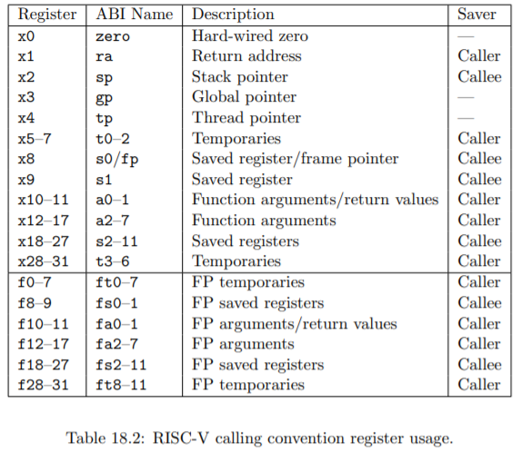
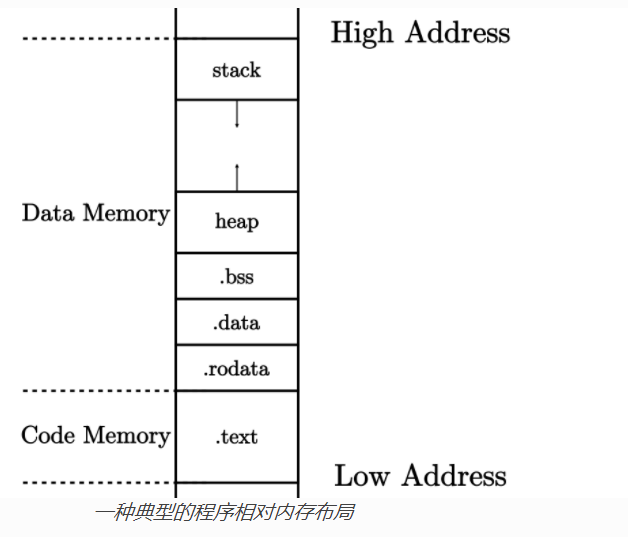
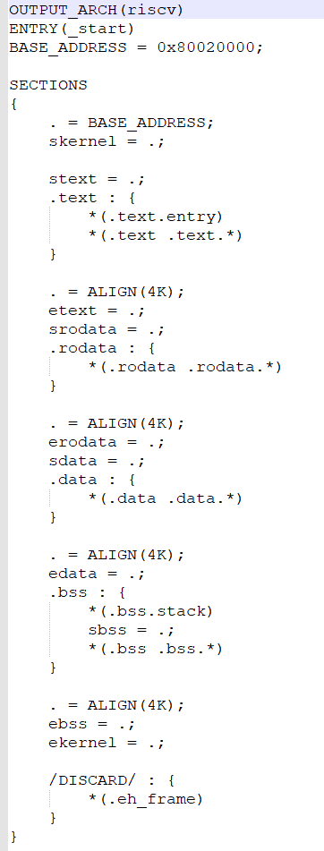

做清华大学操作系统rCore的实验。

实验教程地址：https://rcore-os.github.io/rCore-Tutorial-Book-v3/index.html

原实验构建环境为 ubuntu，提供了模拟器和真机等多种运行环境的模式。

笔者这里构建环境使用 win10，运行环境为 qemu，并且为了方便，构建工具从 makefile 改变为 [cargo-make](https://github.com/sagiegurari/cargo-make) ，配置文件为 Makefile.toml。

**提醒：最好按照原教程中要求的环境和数据进行测试，以免由于多种原因出错后难以寻找。**


学习笔记记录

RISC-V寄存器

| 寄存器组 | 保存者       | 功能                                             |
| -------- | ------------ | ------------------------------------------------ |
| a0~a7    | 调用者保存   | 用来传递输入参数。特别的a0和a1用来保存返回值     |
| t0~t6    | 调用者保存   | 作为临时寄存器使用，在函数中可以随意使用无需保存 |
| s0~s11   | 被调用者保存 | 作为临时寄存器使用，保存后才能在函数种使用       |
|          |              |                                                  |



 

总共32个通用寄存器x0~x31。x0是恒0寄存器。

当从一般意义上讨论 RISC-V 架构的 Trap 机制时，通常需要注意两点：

- 在 触发 Trap 之前 CPU 运行在哪个特权级

- CPU 需要切换到哪个特权级来处理该 Trap 并在处理完成之后返回原特权级。

在 RISC-V 架构中，关于 Trap 有一条重要的规则：在 Trap 前后特权级不会下降。

*进入 S 特权级 Trap 的相关 CSR*

| CSR 名  | 该 CSR 与 Trap 相关的功能                                    |
| ------- | :----------------------------------------------------------- |
| sstatus | `SPP` 字段给出 Trap 发生之前 CPU 处在哪个特权级（S/U）       |
| sepc    | 当 Trap 是一个异常的时候，记录 Trap 发生之前执行的最后一条指令的地址 |
| scause  | 描述 Trap 的原因                                             |
| stval   | 给出 Trap 附加信息                                           |
| stvec   | 控制 Trap 处理代码的入口地址                                 |

## 问题记录与反馈

#### 第一章第四节 [构建用户态执行环境](https://rcore-os.github.io/rCore-Tutorial-Book-v3/chapter1/3-1-mini-rt-usrland.html)

在本章中，构建的是用户态的执行程序，所以模拟器也需要可直接执行用户态的 `qemu-riscv64`，在查询了 qemu 官方的资料后得知，win 上是不行的。故通过 wsl2 上的 `qemu-riscv64` 来运行这节的构建产物。

在尝试实验时我遇到了如下两个问题：

- [实现输出字符串的相关函数](https://rcore-os.github.io/rCore-Tutorial-Book-v3/chapter1/3-1-mini-rt-usrland.html#id5) 时，在实现`Write trait`中调用`sys_write`方法时，使用了常量`STDOUT`，该常量没有在本章中给出。从[后面章节](https://rcore-os.github.io/rCore-Tutorial-Book-v3/chapter2/2application.html#id6) 得知控制台的是`1`，即需要在此定义`const STDOUT: usize = 1;`。

- 在完成上面的函数后，教程中提到，这时会编译失败。

  > 系统崩溃了！借助以往的操作系统内核编程经验和与下一节调试kernel的成果经验，我们直接定位为是 **栈 stack** 没有设置的问题。我们需要添加建立栈的代码逻辑。

  但实际测试时，是直接通过的，反而进行了下面的栈设置之后才会出错。猜测本章节是用户态的程序，而设置栈相关的事物应该是在裸机环境，可能是编写时，不小心将后面教程的部分放到了这里。

在这一章的测试时，还发现了一个有意思的事情，编译出来的产物，可以直接在wsl2上的Ubuntu运行(20.04)。刚开始还以为是编译时带了什么东西，后来将产物拷贝到几台不同的服务器上测试都不行。编译产物放在了`extra/tmp_file`下。


补充，装有docker desktop，并且以wsl2模式运行，当在运行教程一开始提供的镜像时，就能产生上面的效果，当没有运行时，则和普通服务器中的运行结果一样（exec format error）。

#### 第一章第五节 [构建裸机运行时执行环境](https://rcore-os.github.io/rCore-Tutorial-Book-v3/chapter1/3-2-mini-rt-baremetal.html)

在尝试实验时我遇到了如下两个问题：

- [实现关机功能](https://rcore-os.github.io/rCore-Tutorial-Book-v3/chapter1/3-2-mini-rt-baremetal.html#id6) 时，使用了一个常量`SBI_SHUTDOWN`，该常量没有在本章中给出。通过查询[riscv-sbi-doc](https://github.com/riscv/riscv-sbi-doc/blob/master/riscv-sbi.adoc) 得到该值为`8`。但是在设置好之后，其他都是能执行的（打印出了hello world），但还是不能正常退出`qemu`虚拟机，打印出了如下错误，并且`qemu`程序不会结束：

  ```shell
  panicked at 'Unhandled exception! mcause: Exception(StoreFault), mepc: 000000008000261c, mtval: 0000000000100000', platform/qemu/src/main.rs:395:18
  ```
  

上面使用的`win64`的`qemu`，版本为：`QEMU emulator version 5.2.0 (v5.2.0-11850-g0f27b14b91-dirty)`。后在wsl2中使用提供的docker镜像环境测试，运行正常。

- [清空 .bss 段](https://rcore-os.github.io/rCore-Tutorial-Book-v3/chapter1/3-2-mini-rt-baremetal.html#bss) 这个功能，教程里描述的是：

  > 我们需要提供清零的 `clear_bss()` 函数。此函数属于执行环境，并在执行环境调用 应用程序的 `rust_main` 主函数前，把 `.bss` 段的全局数据清零。

我理解的是只需要把函数声明在这里，会自动在`rust_main`前调用。教程里这一节也确实没有调用相关的信息。但是在执行时，感觉像是没有被调用的。

#### 第二章第三节 [实现应用程序](https://rcore-os.github.io/rCore-Tutorial-Book-v3/chapter2/2application.html)

- [系统调用](https://rcore-os.github.io/rCore-Tutorial-Book-v3/chapter2/2application.html#id6) 部分内容，讲到 "变量 `ret` 必须为可变 绑定"，经测试好像不需要。

#### 第二章第四节 [实现批处理操作系统](https://rcore-os.github.io/rCore-Tutorial-Book-v3/chapter2/3batch-system.html)

- bootloader不能使用第一章提供的那个，需要使用第二章里的那个，教程里没有提，让一直跟着教程一点一点做的人有点伤。而且错误的表现形式为：能执行user下的app，但在发生app数量多个时（5个的时候在执行loadapp函数后就会挂掉），或者异常时（只留了3个）会panicked。具体错误信息为：

  > panicked at 'Unhandled exception! mcause: Exception(StoreFault), mepc: 00000000800400a2, mtval: 0000000000000000', platform/qemu/src/main.rs:395:18

  其实在启动时，SBI会打印出不一样的信息，但由于对SBI不是很了解，所以没有具体去看。

  ```shell
  // 第二章提供的SBI打印出的信息
  [rustsbi] Platform: QEMU
  [rustsbi] misa: RV64ACDFIMSU
  [rustsbi] mideleg: 0x222
  [rustsbi] medeleg: 0xb1ab
  [rustsbi] Kernel entry: 0x80020000
  // ----------------------------------
  // 第一章提供的SBI打印出的信息
  [rustsbi] Platform: QEMU
  [rustsbi] misa: RV64ACDFIMSU
  [rustsbi] mideleg: 0x222
  [rustsbi] medeleg: 0xb109
  [rustsbi] Kernel entry: 0x80020000
  ```

  可以看到 `medeleg`的值不一样。通过粗略查询得知和上面的`mideleg`一起，为陷阱委托寄存器（`trap delegation registers`）。

- 添加用户态app的数量过多时qemu会直接panic掉。

  这里原因是代码里直接约定了`APP_BASE_ADDRESS`的地址为`0x80040000`，会在这之后进行数据操作（例如`oad_app`方法），当代码数据过多，超过这个地址时，即会发生错误。还有一个需要小心的点是修改user下的ld文件后在os中执行`make run`可能不会重新执行链接，如下为教程中提供的内存布局图和link文件，app在`.data`段：

   

- bootloader好像不能捕获第三节03、04的app里出现的非法指令错误，在rCore中运行03、04的app均会qemu pannic。

因为rustsbi目前qemu的参考的实现还有部分问题，所以这里暂时更换为opensbi（需要修改一下内核和user的link地址）。